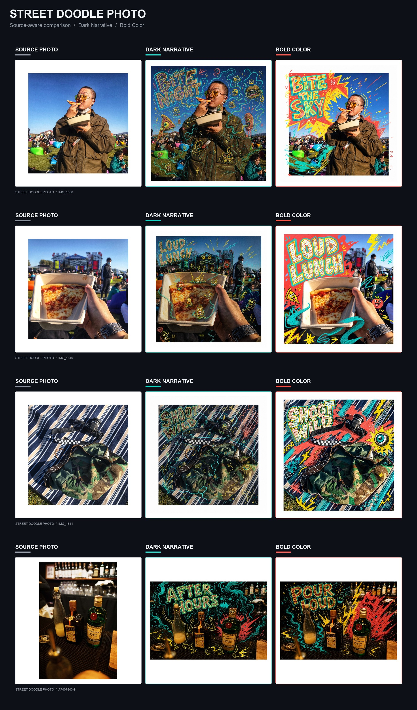
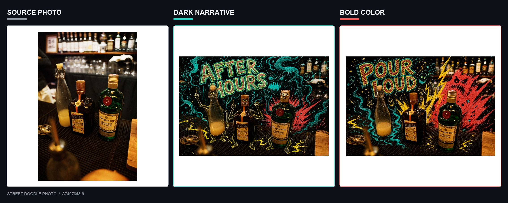
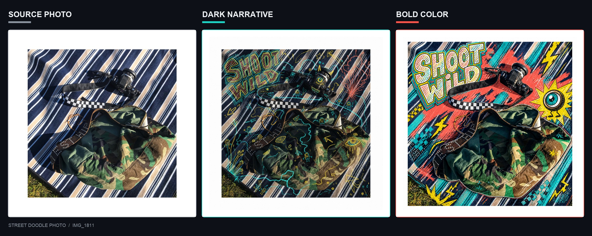

# Street Doodle Photo

Turn a supplied photograph into one authored photo-and-drawing world with scene-aware street doodles, expressive object characters, and hand-built sign lettering.



## What it does

The skill preserves the source's displayed aspect ratio, orientation, full framing, scene identity, and recognizable people and objects while allowing the photograph and drawing to integrate naturally.

Every result includes one scene-aware 1–3 word English phrase by default. The phrase is rendered as irregular multi-outline sign lettering with turquoise and yellow contours, offset echoes, and coral–yellow–turquoise hatch-filled interiors.

### Dark Narrative

Atmospheric fluorescent line networks, personified subjects, deliberate darkness, and restrained local color eruptions.



### Bold Color

Large irregular high-chroma painted masses with rough screen-print edges and immediate underground-poster impact.



## Install in Codex

Ask Codex:

```text
Install the skill from https://github.com/Lawless1920/street-doodle-photo/tree/main/skill/street-doodle-photo
```

Or run the bundled skill installer:

```bash
python3 ~/.codex/skills/.system/skill-installer/scripts/install-skill-from-github.py \
  --repo Lawless1920/street-doodle-photo \
  --path skill/street-doodle-photo
```

The skill becomes available on the next Codex turn after installation.

## Use

Attach a photograph and invoke:

```text
$street-doodle-photo
```

If no mode is supplied, the skill inspects the photograph, recommends a mode, explains the image-generation count, and waits for a choice:

1. **Dark Narrative** — creates one image.
2. **Bold Color** — creates one image.
3. **Compare Both** — creates two independent images and consumes more image-generation usage.

You can also request a mode directly:

```text
Use $street-doodle-photo in Dark Narrative mode on this photo.
```

```text
Use $street-doodle-photo in Bold Color mode on this photo.
```

## Requirements and behavior

- Codex with image-generation access.
- One user-supplied photograph.
- The source file remains read-only; every result is saved separately.
- Full-frame generative editing may reinterpret pixels, color, grain, texture, and lighting. This is not a pixel-preserving transparent overlay.
- The skill validates framing, orientation, identity, mode, phrase spelling, and lettering before delivery.
- A corrective regeneration is never started silently because it consumes additional image-generation usage.

## Skill layout

```text
skill/street-doodle-photo/
├── SKILL.md
├── agents/
│   └── openai.yaml
└── references/
    ├── bold-color.md
    ├── dark-narrative.md
    └── style-system.md
```

## 中文快速说明

上传照片后调用 `$street-doodle-photo`。如果没有指定模式，skill 会先分析照片并让你选择：

1. **Dark Narrative**：暗夜荧光线网与拟人叙事，生成 1 张。
2. **Bold Color**：大面积红黄青色块与街头海报感，生成 1 张。
3. **Compare Both**：两种模式各生成 1 张，共进行 2 次图片生成，会消耗更多图片生成用量。

skill 会保留照片的显示比例、方向、完整构图、人物与主要物体，并自动创作 1–3 个符合场景的英文单词。

## License

The skill instructions and repository code are released under the [MIT License](LICENSE).

Showcase photographs and generated showcase artwork are demonstration material only and are not covered by the MIT License. See [showcase/NOTICE.md](showcase/NOTICE.md).
